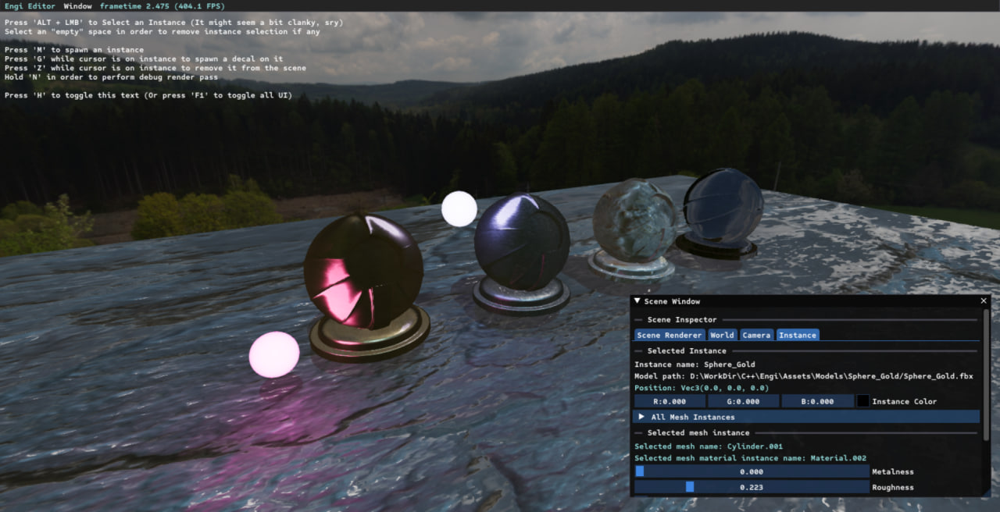
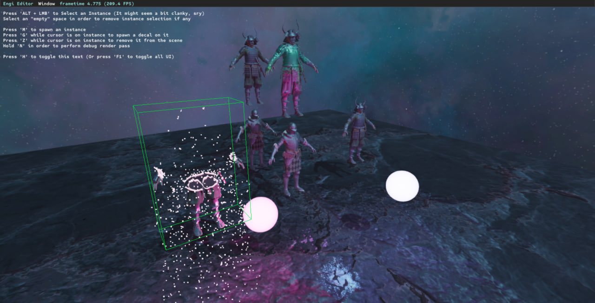
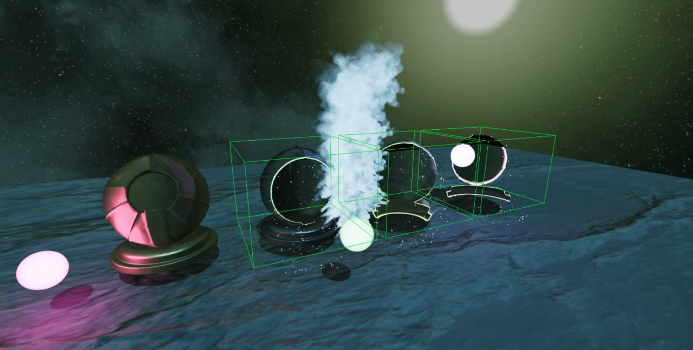

# Engi

My first D3D11 Engine I developed as a part of Dragons Lake 3D Rendering Internship. It requires D3D11 to be installed in order to run. The codebase was designed in the way to fulfill the "most general usecase" of rendering, which, as I now realise, was not the best idea.

## Features

- [x] Physically Based Deferred Renderer
- [x] Plain Shadow Mapping for Point and Spot Lights
- [x] Cascade Shadow Mapping with PCF for Directional Lights
- [x] IBL precompute and caching
- [x] Optimal Instanced Rendering of opaque meshes
- [x] HDR with ACES Tonemapping
- [x] FXAA
- [ ] Editor UI
- [x] CPU-sided Smoke Particles
- [ ] GPU-sided Incineration Particles
- [ ] Physically Based Bloom
- [ ] TAA
- [ ] HLSL Shader caching
- [ ] DDS Texture Loader (Replacement for DirectXTex)

## What you can do in the engine

* You can spawn instances of models, selected in Editor UI by pressing the `M` key
* You can also spawn decals on existing instances by pressing `G` key (Decals may be removed from the selected instance via Editor UI)
* You may select an instance by hovering over it with cursor and pressing `ALT + LMB`
* When instance is selected you can inspect it and change its meshes' material, material instance variables (metalness, roughness, etc.)
* Remove existing instance by pressing `Z` key (This will also spawn GPU-sided incineration particles)
* Drag existing instances by holding `RMB`
* Change skybox at runtime using Editor UI (Skybox should be in Assets/Textures/Skybox folder and have DDS Cubemap format)
* Change both physical (ev100 and gamma correction) and GPU (fov, near/far planes, etc.) settings of camera
* In Editor's "Resource Window" you can inspect all loaded and cached models, shaders and materials
* Loaded and cached shaders can be "hot-reloaded" at runtime
* Loaded and cached materials can be edited at runtime `(WIP)`, which includes editing of rasterizer, depth-stencil and blend states
* You can load and unload cached models in "Resource Window" `(WIP)`

*In order to better understand how the engine works you might want to play with built-in UI*

## Known issues

**There are some known issues that might be fixed in future If I will continue working on the project**
+ *Removing many instances at the same time may crash some Gpu Devices in Debug Build (Problem occured on NVIDIA GeForce RTX 3050 Laptop GPU)*
+ *Resetting window focus may lock some keys thus they won't be removed from Engine's I/O Keymap*
+ *Live D3D11Device objects after the application shutdown*
+ *Many more live objects (ImGui-related) when application is shutdown by closing the console or process termination*
+ *Depth-test may sometimes become disabled when rendering light sources (idk why)*
+ *D3D11 resource naming issues (debug layer yields a ton of warnings)*

## Third parties

Libraries that were used in the engine development

* [Assimp](https://github.com/assimp/assimp/)
* [DirectXTex](https://github.com/microsoft/DirectXTex/)
* [ImGui](https://github.com/ocornut/imgui/)
* [spdlog](https://github.com/gabime/spdlog/)
